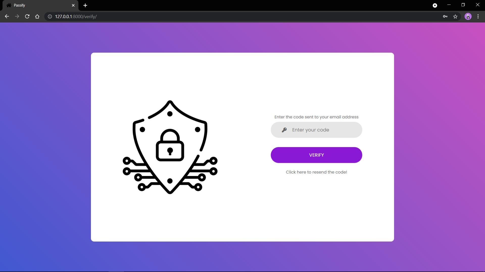
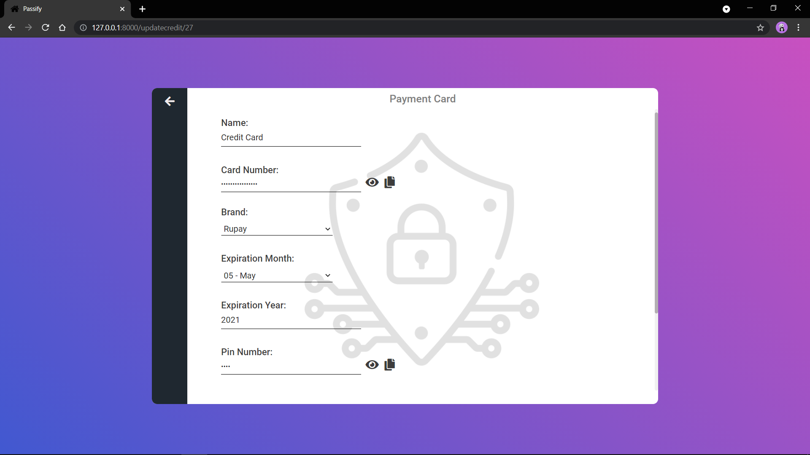

# Passify

A Password Manager written in Django and Python.

It can store Passwords, Payment Cards and Notes. All the passwords, card numbers, card pins, cvv's
notes etc. are first hashed and then stored in the Database. All of the hashed values are decrypted
only when user Logs in, in his/her account.

It has Two-Factor Authentication for more Secure Login and the authentication code is sent to the
user email.

**Plus you cannot choose your Login Passwords as "Sunshine", "Password1" or other common passwords :)**
**It will prompt you to choose a Stronger Password.**

User Login, Authentication and Verification :rocket:





User Homepage and other pages :rocket:





# Installation

1. Clone the respository: ``` git clone https://github.com/ArpitSandal/Password-Manager-Django.git```

2. Install django and make sure you have python installed: ``` pip install django ```

3. cd into the passify folder and type : ``` python manage.py runserver ```

4. View in browser at: ``` http://127.0.0.1:8000/ ```


**Note: Please provide the Email and Password through which the verification code is being sent otherwise it will throw an error.**

# Here's How to do it!

Goto ``` passify\task\views.py ``` and enter the mail and password in the ``` send_mail() ``` function

# Here's how it looks:

